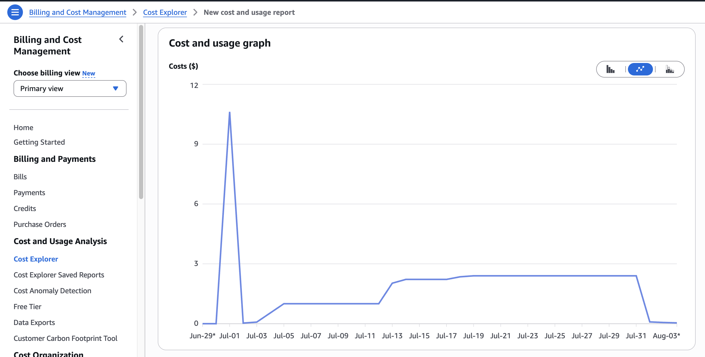
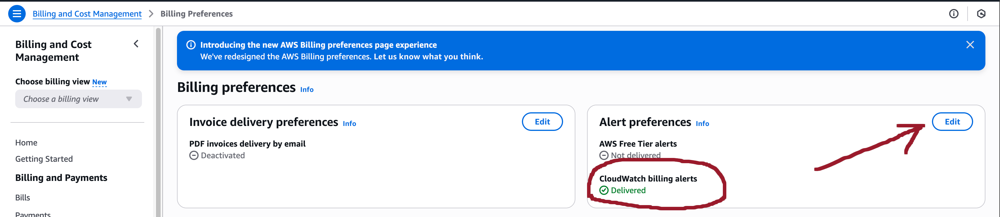

# Terraform Cost Guard — FinOps PoC for Idle Resource Detection & Cleanup

## What it does
## Safety & controls
## How to run
## Observability & outcome
## 🚀 Quick Start
## 🎬 Live Demo
## 🛠️ How It Works
## 🔧 Inputs
## 📤 Outputs
## FinOps: Athena + CUR and a Fast Backfill (PoC)
### Architecture (TL;DR)
### Prerequisites
### Terraform: finops_cur module (key points)
### Post-apply: one-time manual steps
### Quick backfill (June–July) from Cost Explorer
### Grafana (Docker, local)
### Common errors & quick fixes
### PoC cleanup
### Appendix: minimal IAM policy for Grafana (Athena)
### Roadmap / “proper” approach
## 📈 Dashboard
## 📊 Extended description Grafana: Setup & Usage
## 🧰 Development & Tests
## 📜 License
## Logs after stop
## 💰 Cost Comparison: AWS vs. Bare metal

[](https://www.terraform.io)
[](LICENSE)

# FinOps PoC — Idle-killer (discover → approve → act)

## What it does

* **Discover (safe by default):** scans the AWS account for **idle** resources — EC2 (low CPU / no network), detached or orphaned **EBS** volumes, **RDS** with no connections, and quiet **ECS/Fargate** services.
  Findings are **logged with reasons** (what, where, why it’s idle, proposed action).
* **Act (opt-in):** when the **execution flag** is enabled, the PoC applies cleanup: stop/terminate EC2, delete/archive EBS, scale down/disable services, etc.

## Safety & controls

* **Dry-run first**: no destructive actions unless explicitly enabled.
* **Tag guards**: resources with `keep=true` (or your configured allowlist) are skipped.
* **Idempotent** actions with detailed audit logs.

## How to run

```bash
# 1) Discover only (logs only)
teraform init && terraform apply -auto-approve

# 2) Change to dry-run mode (no actions) in ./examples/simple/main.tf
# dry_run = true
terraform apply
```

## Observability & outcome

* Logs in **CloudWatch** (and/or S3 if configured) with per-resource decisions.
* Cost impact validated via **Athena → Grafana** daily **\$/day** chart (before/after).


---

## 🚀 Quick Start

```hcl
module "cost_guard" {
  source        = "github.com/your‑org/terraform-cost-guard"

  # Core settings
  idle_days     = 7                    # How many idle days before action
  regions       = ["us‑east‑1"]        # Regions to scan
  exclude_tags  = ["production"]       # Resources with these tags are ignored

  # Safety
  dry_run       = true                 # Set to false to actually stop instances
}
```

```bash
terraform init && terraform apply -auto-approve
```

---

## 🎬 Live Demo

[](assets/cost-explorer1.png)

[](assets/before-after.png)

▶ **90‑second Loom walkthrough:** [https://loom.com/share/REPLACE\_ME](https://loom.com/share/REPLACE_ME)

*Example result: daily spend dropped from **\$12.40** to **\$7.85** (–37%) within two weeks.*

---

## 🛠️ How It Works

1. **Discovery** – A Lambda (built via this module) queries CloudWatch metrics and tags to find idle resources.
2. **Filter** – If CPU / IOPS ≈ 0 for `idle_days`, the resource is flagged.
3. **Action** – `ec2 stop‑instances` & `ebs disable-volume` (or report‑only in dry‑run).
4. **Dashboard** – Cost Explorer data feeds a minimal Grafana panel (`grafana-dash.json`).

---

## 🔧 Inputs

| Name           | Description                                                | Type           | Default         |
| -------------- | ---------------------------------------------------------- | -------------- | --------------- |
| `idle_days`    | Days of zero activity before a resource is considered idle | `number`       | `7`             |
| `regions`      | AWS regions to inspect                                     | `list(string)` | `["us‑east‑1"]` |
| `exclude_tags` | Tag keys that exclude resources from Guard                 | `list(string)` | `[]`            |
| `dry_run`      | If true, only report idle resources without stopping them  | `bool`         | `true`          |

## 📤 Outputs

| Name                      | Description                            |
| ------------------------- | -------------------------------------- |
| `stopped_instances`       | IDs of EC2 instances that were stopped |
| `estimated_savings_daily` | Approx. USD saved per day              |

---


# FinOps: Athena + CUR and a Fast Backfill (PoC)

> Goal: produce a **daily cost** time series in Grafana for a FinOps PoC, even if historical data wasn’t originally exported. Pipeline: CUR → S3 (us‑east‑1) → Glue Crawler → Athena (eu‑central‑1) → Grafana. For June–July we do a **quick backfill** from Cost Explorer.

---

## Architecture (TL;DR)

* **CUR (legacy)** writes Parquet files to S3 bucket `cost-baseline-trash-cur-ac570c21` in **us‑east‑1**.
* **Glue Crawler** builds the Glue **database `aws_cur`** and a table **`cost_baseline_trash_daily_parquet`**.
* **Athena** runs in **eu‑central‑1**, workgroup **`finops-cur`**, and writes query results to `s3://athena-results-851725515436-eu-central-1/`.
* **Grafana (Docker, local)** connects to Athena and plots the time series.
* For months *before* CUR was enabled (June–July) we backfill from **Cost Explorer** (TSV → S3 → external table → view that unions CE + CUR).

> Note: the **“Receive Billing Alerts”** checkbox only affects CloudWatch `AWS/Billing` metrics (EstimatedCharges). It is **not** related to CUR/Athena.

---

## Prerequisites

* AWS CLI is configured and working.
* IAM permissions (minimum): `cur:PutReportDefinition`, `s3:*` on your buckets, `glue:*`, `athena:*` (read/query), `sts:GetCallerIdentity`.
* Regions: CUR bucket in **us‑east‑1**, Athena/Glue/results in **eu‑central‑1**.

---

## Terraform: `finops_cur` module (key points)

* Uses provider alias `aws.us_east_1` (CUR API is global; CUR S3 sits in us‑east‑1).
* Creates:

    * S3 for CUR (`cost-baseline-trash-cur-<hex>`, here: `cost-baseline-trash-cur-ac570c21`) with `force_destroy` and lifecycle retention.
    * Bucket policy for `billingreports.amazonaws.com`.
    * `aws_cur_report_definition` (Parquet + `RESOURCES` + `ATHENA`).
    * Athena workgroup `finops-cur` with results at `s3://athena-results-851725515436-eu-central-1/`.
    * Glue: `aws_glue_catalog_database aws_cur`, `aws_glue_crawler cost-baseline-trash-cur-crawler`, and an IAM role for the crawler.

### Root wiring example

```hcl
provider "aws" { region = "eu-central-1" }
provider "aws" { alias = "us_east_1" region = "us-east-1" }

terraform {
  required_providers {
    aws    = { source = "hashicorp/aws", version = ">= 5.50.0" }
    random = { source = "hashicorp/random", version = "~> 3.6" }
  }
}

module "finops_cur" {
  source     = "../../modules/finops_cur"
  project    = "cost-baseline-trash"
  aws_region = "eu-central-1"
  providers = {
    aws           = aws
    aws.us_east_1 = aws.us_east_1
    random        = random
  }
}
```

### Notes / small fixes

* `aws_s3_bucket_lifecycle_configuration` must include `filter { prefix = "" }`.
* For Glue DB use **`aws_glue_catalog_database`** (not `aws_glue_database`).
* If the Athena results bucket already exists (`athena-results-851725515436-eu-central-1`), import it:

  ```bash
  terraform import 'module.finops_cur.aws_s3_bucket.athena_results' athena-results-851725515436-eu-central-1
  ```

---

## Post‑apply: one‑time manual steps

1. **Verify CUR files**:

   ```bash
   aws s3 ls s3://cost-baseline-trash-cur-ac570c21/cur/ --region us-east-1
   ```

   Expect first Parquet files within 2–24h after enabling the report.
2. **Run Glue Crawler** (creates the table):

   ```bash
   aws glue start-crawler --name cost-baseline-trash-cur-crawler --region eu-central-1
   ```
3. **Athena** (eu‑central‑1, WG `finops-cur`): database `aws_cur`, table `cost_baseline_trash_daily_parquet`.

---

## Quick backfill (June–July) from Cost Explorer

> Purpose: get history before CUR was active without migrating to Data Exports right now.

1. **Create TSV locally**

```bash
aws ce get-cost-and-usage \
  --time-period Start=2025-06-01,End=2025-08-01 \
  --granularity DAILY \
  --metrics UnblendedCost \
  --query 'ResultsByTime[*].[TimePeriod.Start,Total.UnblendedCost.Amount]' \
  --output text \
| tr -d '\r' > /tmp/ce_backfill_jun_jul.tsv

head -n 5 /tmp/ce_backfill_jun_jul.tsv   # should show dates, not "None"
```

2. **Upload to S3 (eu‑central‑1)**

```bash
aws s3 cp /tmp/ce_backfill_jun_jul.tsv \
  s3://athena-results-851725515436-eu-central-1/ce-backfill/ \
  --region eu-central-1
```

3. **Athena: table & views** *(run each as a separate query)*

```sql
-- Robust parser for TSV/space+tab via RegexSerDe (raw table)
DROP TABLE IF EXISTS aws_cur.ce_backfill_regex;
CREATE EXTERNAL TABLE aws_cur.ce_backfill_regex (
  day_str  string,
  cost_str string
)
ROW FORMAT SERDE 'org.apache.hadoop.hive.serde2.RegexSerDe'
WITH SERDEPROPERTIES ("input.regex" = "^(\\S+)\\s+(\\S+)$")
LOCATION 's3://athena-results-851725515436-eu-central-1/ce-backfill/';

-- Safe type casting
CREATE OR REPLACE VIEW aws_cur.ce_backfill AS
SELECT
  try_cast(day_str  AS date)   AS day,
  try_cast(cost_str AS double) AS cost_usd
FROM aws_cur.ce_backfill_regex
WHERE try_cast(day_str AS date) IS NOT NULL
  AND try_cast(cost_str AS double) IS NOT NULL;

-- Union CE backfill + live CUR (no hard date boundary)
CREATE OR REPLACE VIEW aws_cur.cost_daily AS
SELECT day, ROUND(SUM(cost_usd), 2) AS cost_usd
FROM (
  SELECT day, cost_usd FROM aws_cur.ce_backfill
  UNION ALL
  SELECT
    date_trunc('day', CAST(line_item_usage_start_date AS timestamp)) AS day,
    CAST(line_item_unblended_cost AS double)                         AS cost_usd
  FROM aws_cur.cost_baseline_trash_daily_parquet
) t
WHERE day IS NOT NULL
GROUP BY day;
```

4. **Check**

```sql
SELECT day, cost_usd
FROM aws_cur.cost_daily
WHERE day >= DATE '2025-06-01'
ORDER BY day;
```

---

## Grafana (Docker, local)

1. **Run Grafana with the Athena plugin**

```bash
docker stop grafana 2>/dev/null && docker rm grafana 2>/dev/null

docker run -d --name grafana -p 3000:3000 \
  -e GF_INSTALL_PLUGINS=grafana-athena-datasource \
  -e AWS_SDK_LOAD_CONFIG=1 \
  -v grafana-data:/var/lib/grafana \
  -v $HOME/.aws:/usr/share/grafana/.aws:ro \
  grafana/grafana:latest
```

2. **Add data source → Amazon Athena**

    * Region: `eu-central-1`
    * Workgroup: `finops-cur`
    * Catalog: `AwsDataCatalog`
    * Database: `aws_cur`
    * Output location: `s3://athena-results-851725515436-eu-central-1/`
3. **Panel (Time series)**

```sql
SELECT
  day AS time,
  cost_usd
FROM aws_cur.cost_daily
WHERE day >= DATE '2025-06-01' AND day <= current_date
ORDER BY day;
```

Unit: **USD**. Add an annotation at the optimization start date.

---

## Common errors & quick fixes

* **Athena: “The S3 location provided… is invalid”** → results bucket must be in the *same region* as Athena. Use `athena-results-851725515436-eu-central-1` in WG `finops-cur`.
* **`SCHEMA_NOT_FOUND`** → no CUR files yet; wait up to 24h or run Glue Crawler; `aws_cur` will appear after the first pass.
* **`TABLE_NOT_FOUND`** → the real table name differs (dashes replaced). `SHOW TABLES IN aws_cur;` and update SQL.
* **S3 `BucketAlreadyOwnedByYou`** → the bucket was created manually; import it into state.
* **Lifecycle warning** → add `filter { prefix = "" }` to `aws_s3_bucket_lifecycle_configuration`.
* **Glue “unsupported resource”** → upgrade AWS provider to `>= 5.50.0` and use `aws_glue_catalog_database`.
* **Backfill parsing issues** → use RegexSerDe + `try_cast` as shown above.

---

## PoC cleanup

```bash
# remove CE backfill CSV/TSV if desired
aws s3 rm s3://athena-results-851725515436-eu-central-1/ce-backfill/ --recursive --region eu-central-1

# terraform destroy in the env folder will remove CUR bucket, WG, crawler, etc.
```

---

## Appendix: minimal IAM policy for Grafana (Athena)

```json
{
  "Version": "2012-10-17",
  "Statement": [
    {"Effect":"Allow","Action":[
      "athena:StartQueryExecution","athena:GetQueryExecution","athena:GetQueryResults",
      "athena:ListWorkGroups","athena:ListDataCatalogs","athena:ListDatabases","athena:ListTableMetadata"
    ],"Resource":"*"},
    {"Effect":"Allow","Action":[
      "glue:GetDatabase","glue:GetDatabases","glue:GetTable","glue:GetTables"
    ],"Resource":"*"},
    {"Effect":"Allow","Action":["s3:GetObject","s3:ListBucket"],
     "Resource":[
       "arn:aws:s3:::athena-results-851725515436-eu-central-1",
       "arn:aws:s3:::athena-results-851725515436-eu-central-1/*"
     ]}
  ]
}
```

---

## Roadmap / “proper” approach

* Migrate from legacy CUR to **Billing → Data Exports (Cost & Usage)** with Athena auto‑integration and request historical backfill from AWS Support.
* Replace CE CSV/TSV backfill with native Parquet.
* Add unit‑cost KPIs (divide by `usage_amount`), tags/BU filters, etc.


## 📈 Dashboard


### Adding permissions to your AWS credentials:

[](assets/setup-gr-in-aws.png)


For MAC users, add the following to your `~/.aws/credentials` file:

```bash
docker run -d -p 3000:3000 --name=grafana \
-v "$HOME/.aws:/usr/share/grafana/.aws:ro" grafana/grafana

Check conection to AWS
docker exec -u grafana -it grafana cat /usr/share/grafana/.aws/credentials
```

1. Import `grafana-dash.json` into Grafana ≥ v10.
2. Set variable `$AWS_ACCOUNT_ID` to your account ID.
3. Watch the cost line drop like a stone 🪨.


## 📊 Extended description Grafana: Setup & Usage

This module ships with a ready-to-import dashboard JSON. You can use Grafana with a **quick path** (Cost data source or built-in cost alerts) or a **power path** (Athena + CUR) for richer analytics.

### 1) Install Grafana (macOS)

**Option A — Docker (quick):**

```bash
docker run -d --name grafana -p 3000:3000 \
  -e GF_SECURITY_ADMIN_USER=admin \
  -e GF_SECURITY_ADMIN_PASSWORD=admin \
  -v $(pwd)/grafana/provisioning:/etc/grafana/provisioning \
  -v $(pwd)/grafana/dashboards:/var/lib/grafana/dashboards \
  grafana/grafana:10.4.0
```

Open [http://localhost:3000](http://localhost:3000) (admin / admin).

**Option B — Native (Homebrew):**

```bash
brew install grafana
brew services start grafana
```

Open [http://localhost:3000](http://localhost:3000).

> Tip: If you don’t need provisioning, you can omit the mounted folders in Docker.

---

### 2) Pick your data path

**Quick path — use Cost data source / built-in cost alerts**

* If your Grafana has an **AWS Cost Explorer** (or **Grafana Cloud Cost**) data source available, add it and you’ll get daily spend out-of-the-box.
* You can then attach an **Alert** to the spend panel (e.g., trigger if daily spend > budget).
* Alternatively, skip Grafana entirely and enable **AWS Budgets** and **Cost Anomaly Detection** in the AWS console for native cost alerts.

**Power path — Athena over the AWS Cost & Usage Report (CUR)**

* Recommended when you want custom aggregations, tags/linked-account splits, or multi-panel analytics.

---

### 3) Configure the data source

#### A. AWS Cost (if available in your Grafana)

1. **Add data source** → *AWS Cost Explorer* or *Grafana Cloud Cost*.
2. **Auth**: Use an IAM role on the host or static keys with read-only permissions to Cost Explorer.
3. **Region**: Cost Explorer is global but API endpoints live in `us-east-1`; set that region if prompted.
4. **Test & Save**.

#### B. Athena + CUR (advanced)

1. **Enable CUR**: In AWS Billing → Cost & Usage Reports, create a report to S3 (prefer **Parquet**, daily, with partitions).
2. **Glue Catalog**: Let AWS auto-create the Glue table, or create it manually.
3. **Athena**: Create a **workgroup** and set **Query results location** (e.g., `s3://athena-results-<acct>-<region>/query-results/`).
4. **Query**: Build a daily spend view. Example:

```sql
-- Daily unblended cost
SELECT date_trunc('day', line_item_usage_start_date) AS day,
       SUM(line_item_unblended_cost)                AS cost_usd
FROM   aws_cur.your_cur_table
WHERE  year = 2025  -- or filter by date range
GROUP BY 1
ORDER BY 1;
```

5. **Grafana data source**: Add **Amazon Athena** data source and point to your **Workgroup**, **Catalog** (usually `AwsDataCatalog`), and **Database**.

---

### 4) Import the dashboard JSON

You can use the repository dashboard as-is:

1. In Grafana → **Dashboards → Import**.
2. Upload `grafana/grafana-dash.json` (exported with **Export for sharing externally**).
3. When prompted, **select your data source** (Cost or Athena).
4. Click **Import**. Done.

> The dashboard expects a daily series named like `cost_by_date` or the SQL above aliased as `cost_usd`. You can edit the query in the panel if your field names differ.

---

### 5) Optional: provisioning for one-click setup

Provisioning lets Grafana auto-create data sources and dashboards at startup.

**Datasource provisioning (example for Athena):**

```yaml
# grafana/provisioning/datasources/ds.yaml
apiVersion: 1

datasources:
  - name: Athena (Cost Guard)
    type: grafana-athena-datasource
    isDefault: false
    editable: true
    jsonData:
      defaultRegion: ${AWS_REGION}
      workgroup: ${ATHENA_WORKGROUP}
      catalog: ${ATHENA_CATALOG}
      database: ${ATHENA_DATABASE}
      outputLocation: ${ATHENA_OUTPUT}
```

**Dashboard provisioning (optional):**

```yaml
# grafana/provisioning/dashboards/dash.yaml
apiVersion: 1

providers:
  - name: CostGuard
    type: file
    disableDeletion: true
    updateIntervalSeconds: 30
    options:
      path: /var/lib/grafana/dashboards
```

Place `grafana-dash.json` under `grafana/dashboards` and mount that folder for Docker (see install command).

---

### 6) Alerts

* **Quick**: On the cost panel, toggle **Alert** and create a rule like “Daily spend > \$X for 1h”. Use email/Slack/Teams notifiers.
* **Athena-based**: Use a time series query (e.g., last 24h spend) and create an alert rule on the resulting series. Schedule the rule at a cadence that matches your data freshness (CUR often lags by a few hours).
* **AWS-native**: If you prefer not to use Grafana for alerting, enable **AWS Budgets** and **Cost Anomaly Detection** in the AWS console.

---

### 7) Files to include in the repo

```
/grafana/
  grafana-dash.json                  # exported with "Export for sharing externally"
  /provisioning/datasources/ds.yaml  # optional
  /provisioning/dashboards/dash.yaml # optional
/athena/
  cost_daily.sql                     # example query
/assets/
  before-after.png
```

### 8) Troubleshooting

* **No data**: CUR can lag; give it a few hours. Ensure the SQL filters (year/month/date) match your data.
* **Import errors**: Re-export the dashboard with **Export for sharing externally** to strip local UIDs.
* **Region issues**: Cost Explorer is effectively `us-east-1`. Athena runs in the region of your S3/Glue setup.
* **Auth**: Prefer IAM roles over static keys when possible.

---

## 🧰 Development & Tests

```bash
make test   # unit tests
make lint   # terraform fmt & tflint
make release # tag & publish v0.x.x
```

---

## 📜 License

MIT © Oleksandr Zakrevskyi


## Logs after stop

START RequestId: a4411e9d-0a26-4090-93b3-4229ce6ec047 Version: $LATEST
2025-08-01T19:25:11.169Z	a4411e9d-0a26-4090-93b3-4229ce6ec047	INFO	EBS vol-09751ceb4caa0862c idle (dryRun=false)
2025-08-01T19:25:11.417Z	a4411e9d-0a26-4090-93b3-4229ce6ec047	INFO	EBS vol-0aa993e3c3cbad968 idle (dryRun=false)
2025-08-01T19:25:11.570Z	a4411e9d-0a26-4090-93b3-4229ce6ec047	INFO	EBS vol-08f211f3e651d9d82 idle (dryRun=false)
2025-08-01T19:25:11.692Z	a4411e9d-0a26-4090-93b3-4229ce6ec047	INFO	Projected (remaining) until the end of the month: $12.00
2025-08-01T19:25:11.692Z	a4411e9d-0a26-4090-93b3-4229ce6ec047	INFO	full-month: $12.00
END RequestId: a4411e9d-0a26-4090-93b3-4229ce6ec047
REPORT RequestId: a4411e9d-0a26-4090-93b3-4229ce6ec047	Duration: 3190.16 ms	Billed Duration: 3191 ms	Memory Size: 128 MB	Max Memory Used: 128 MB	Init Duration: 842.33 ms

## 💰 Cost Comparison: AWS vs. Bare metal
If you want total savings, then compare bare metal and solutions from Amazon

| Component                     | AWS (On-Demand, **us-east-1**)                                                          | Hetzner bare-metal                                                                |
| ----------------------------- | --------------------------------------------------------------------------------------- | --------------------------------------------------------------------------------- |
| **Compute (services + jobs)** | 20 × m6i.large → **\$1 402 / mo** ([Amazon Web Services][1])                            | 3 × AX102 (32c / 128 GB) → **€ 327 ≈ \$356 / mo**   (+ €117 setup) ([Hetzner][2]) |
| **Kubernetes control-plane**  | Amazon EKS \$0.10 h → **\$73 / mo** ([Amazon Web Services][3])                          | kubeadm on same nodes → **\$0**                                                   |
| **Load balancer**             | ALB \$0.0225 h + 1 LCU ≈ **\$32 / mo** ([Amazon Web Services][4])                       | HAProxy / Traefik → **\$0**                                                       |
| **Redis cache**               | ElastiCache (3 × cache.r6g.large \$0.165 h) → **\$361 / mo** ([Amazon Web Services][5]) | Redis in pods/VM → **\$0**                                                        |
| **Kafka queue**               | MSK 3 × kafka.m5.large \$0.21 h + 1 TB EBS → **\$569 / mo** ([Amazon Web Services][6])  | Kafka on same servers → **\$0**                                                   |
| **PostgreSQL**                | RDS db.r6i.large \$0.29 h → **\$211 / mo** ([Amazon Web Services][7])                   | Postgres in Docker → **\$0**                                                      |
| **MongoDB**                   | DocumentDB (2 × db.r5.large) → **\$445 / mo** ([Amazon Web Services][8])                | MongoDB self-host → **\$0**                                                       |
| **Columnar analytics**        | Redshift RA3.xlplus \$1.086 h → **\$793 / mo** ([Amazon Web Services][9])               | ClickHouse on same nodes → **\$0**                                                |
| **Object storage**            | S3 5 TB @ \$0.023 GB → **\$115 / mo** ([Amazon Web Services][10])                       | Storage Box BX21 5 TB → **€ 10.9 ≈ \$12 / mo** ([Hetzner][11])                    |
| **DNS**                       | Route 53 10 zones → **\$5 / mo** ([Amazon Web Services][12])                            | Hetzner DNS → **\$0**                                                             |
| **Observability**             | CloudWatch ≈ **\$15 / mo** ([Amazon Web Services][1])                                   | Prometheus + Grafana → **\$0**                                                    |
| **Egress traffic (10 TB)**    | \$0.09 GB → **\$913 / mo** ([Amazon Web Services][13])                                  | 20 TB included → **\$0**                                                          |
| ***Monthly total***           | **≈ \$4 485**                                                                           | **≈ \$368**                                                                       |

[1]: https://aws.amazon.com/ec2/pricing/on-demand/ "EC2 On-Demand Instance Pricing – Amazon Web Services"
[2]: https://www.hetzner.com/news/new-amd-ryzen-7950-server/?utm_source=chatgpt.com "UPGRADE TO THE FUTURE: THE NEW AX102 DEDICATED SERVER WITH ... - Hetzner"
[3]: https://aws.amazon.com/eks/pricing/?utm_source=chatgpt.com "Amazon EKS Pricing"
[4]: https://aws.amazon.com/elasticloadbalancing/pricing/?utm_source=chatgpt.com "Elastic Load Balancing pricing"
[5]: https://aws.amazon.com/elasticache/pricing/?utm_source=chatgpt.com "Pricing for Amazon ElastiCache"
[6]: https://aws.amazon.com/msk/pricing/?utm_source=chatgpt.com "Amazon MSK pricing - Managed Apache Kafka"
[7]: https://aws.amazon.com/rds/postgresql/pricing/?utm_source=chatgpt.com "Amazon RDS for PostgreSQL Pricing"
[8]: https://aws.amazon.com/documentdb/pricing/ "Amazon DocumentDB Pricing - Amazon Web Services"
[9]: https://aws.amazon.com/blogs/big-data/introducing-amazon-redshift-ra3-xlplus-nodes-with-managed-storage/?utm_source=chatgpt.com "Introducing Amazon Redshift RA3.xlplus nodes with managed storage"
[10]: https://aws.amazon.com/s3/pricing/ "Amazon S3 Pricing - Cloud Object Storage - AWS"
[11]: https://www.hetzner.com/dedicated-rootserver/matrix-sx/?utm_source=chatgpt.com "Storage Server – High-Capacity Dedicated Hosting"
[12]: https://aws.amazon.com/route53/pricing/ "Amazon Route 53 pricing - Amazon Web Services"
[13]: https://aws.amazon.com/ec2/pricing/on-demand/?utm_source=chatgpt.com "EC2 On-Demand Instance Pricing"
